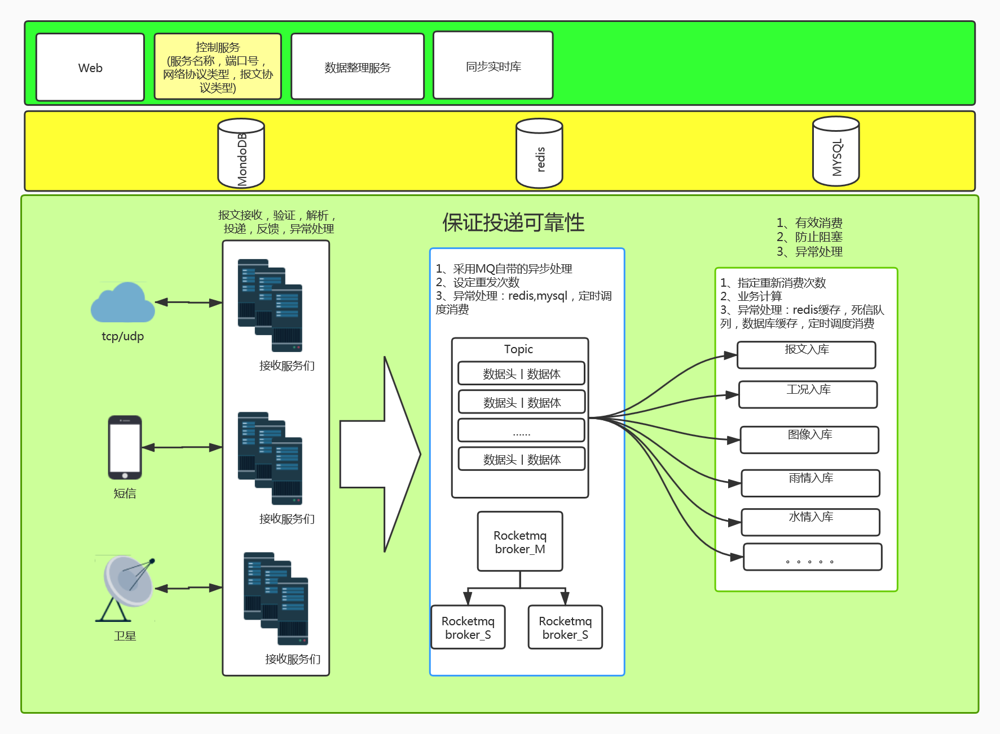

# 一、背景

​		对国内用户而言，实现信息安全的必要条件是信息化关键软硬件产品的国产化。只有这样，才能确保真正的信息安全。

​		为相应国家软件国产化的号召，我们在原稳定运行多年的遥测接收平台基础上，进行软件国产化的产品升级与完善。在增强系统稳定性的基础上，保证了系统在国产操作系统上的可移植性，保证了与国产数据库的适配，进一步保障信息安全和数据安全。加速软件国产化进程。 


# 二、设计原则

> **部署环境**:

1.加强对国产操作系统和当前主流操作系统的可移植性和扩展性；

2.增强对国产数据库的适配，保持对当前主流操作系统的 支持和应用；


> **业务拓展:**

1、跨领域数据接收和应用，在原有遥测站点数据接收的基础上，增加其他领域的设备接收支持（农业，灌区等）

2、原基于串口、短信、数据库、卫星等接收方式保留 


> **可靠性优化:**

1、依据saas服务的方式进行设计和研发，增强系统对高并发量的支持，利用NIO(同步非阻塞)取代原有的阻塞式IO，提高系统吞吐量 ；

2、增加对流量峰值的削峰操作，在保证数据安全稳定不丢失的情况下进行削峰处理，保证系统可用性；

3、利用内存数据库对原有的内存存储数据进行优化，保证业务处理速度的基础上，确保在系统异常情况下的数据安全；

4、加强异常处理机制，在数据从接收到入库的各个环节，增强异常处理，确保数据安全；


# 三、模块设计

## 3.1 功能结构图



## 3.2 服务暴露

​		TCP协议和UDP协议的接收服务，基于Netty进行服务地址和端口暴露。由Netty提供异步的、事件驱动的网络应用程序，可以快速开发高性能、高可靠性的网络服务。

​		卫星和短信接收机制用传统的串口通讯方式进行数据接收；

## 3.3 削峰及可靠性

**流量接收问题**:

​		面对瞬时的大量报文请求，Netty的非阻塞机制可以很好的接收请求，并分发给对应的线程进行业务处理。各线程处理流程为`报文校验 => 报文解析 => 数据入库 => 设备反馈` 。因入库环节涉及到IO交互，所以会造成大量的线程被阻塞，不能及时的对设备进行反馈，从而造成设备重发，甚至丢弃报文。而大量的线程阻塞会造成系统宕机和死机，降低系统的可用性。

> **流量削峰:**

​		在基于Netty进行请求接收和工作线程分派之后，各线程执行的业务流程顺序为：

​		`报文校验 => 报文解析 => 数据投递(MQ) => 设备反馈`

​		 其中，数据投递的消息队列采用高性能的RocketMQ进行异步可靠性投递，在接到投递的返回结果后再确定如何进行设备反馈。

> **MQ可靠性**:

​		MQ的可靠性，包括数据的`投递可靠性`和`消费可靠性`。在流量削峰中，我们采用消息的`可靠性投递来`确保消息被投递到`消息队列`中。消息的生产者可以设定最大投递次数，并将投递结果进行返回。以保证业务逻辑的合理性和数据的安全性。

​		当前系统设定最大投递次数为**3**，采用`异步投递`的方式进行`可靠性投递`。当投递遇到异常的时候，暂将消息缓存到`Redis的阻塞队列`中。确保消息被`持久化`，然后进行`二次投递`。


## 3.4 遥测数据入库

​		数据入库服务是将投递到`消息队列`中的数据，进行消费入库。数据入库可以采用多线程消费的方式进行数据入库。多个线程组成一个消费组，进行并行消费。

​		消费这根据入库处理的处理过程，对结果进行有效反馈，以确保所有数据的正常入库。

> **消费异常处理:**

​		当消费入库业务执行异常后，也就是消息没有被正常消费掉，那么次消息会被投递到`延时队列`进行`衰减重试`。以避免后续的消息被阻塞。

​		根据RocketMQ的默认设定，衰减重试的次数为18次，也就是18个级别，我们可以根据业务需要，手动调整消息队列的参数，按照自定义的衰减级别进行`延时投递`。系统默认的延时投递级别为:

```.java
String messageDelayLevel = "1s 5s 10s 30s 1m 2m 3m 4m 5m 6m 7m 8m 9m 10m 20m 30m 1h 2h"
```

​		当18个级别的延时投递依然投递失败，那么RocketMQ会将消息投递到`死信队列`，此时需手工对死信队列中的消息进行处理。

​		

## 3.5 数据库服务

> **Mysql 5.7：**

​		作为主数据服务，用于存储业务数据，系统数据和设备采集的实时数据。  


> **Redis：**

​		1、用于消息投递的异常处理，通过阻塞队列的方式对消息进行二次投递。

​		2、用于缓存配置信息，基础数据，远程控制指令等   


> **MongoDB:**

​		用于对日志数据进行保存，暂未使用


## 3.6 Web端

​		Web端采用VUE架构进行搭建，采用前后端分离的方式进行开发。拥有系统自主的登录和权限系统功能。

> **当前已完成:**

​		1、系统登录与主体框架搭建完毕

​		2、权限系统开发完成

​		3、服务管理功能开发完成，可以对接收服务进行`新增，删除，启动，关闭`

​		4、基于宝泉岭的农业数据展示完成，基于黑龙江地下水的实时数据展示完成

​		5、测站基础信息管理功能开发完成

​		6、基于测站的远程控制开发完成(校时，设参，固态提取，召测)

​		7、拦截规则功能开发中ing


> **待开发功能:**

待开发功能

​		1、基于gis的地图监视功能

​	    2、告警阈值设定及故障展示

​		3、数据审核

​		4、服务监控

​		5、对外Rest接口

​		6、查询统计

​		7、资料整编结果处理

​		8、数据管理(数据清理，数据导出和各种图表)


> **当前页面展示:**


# 四、具体模块流程

## 4.1  报文接收服务流程

_liliwei/image-20200811161737662.png)


## 4.2 遥测数据入库流程

​		_liliwei/image-20200811161854275.png)


# 


